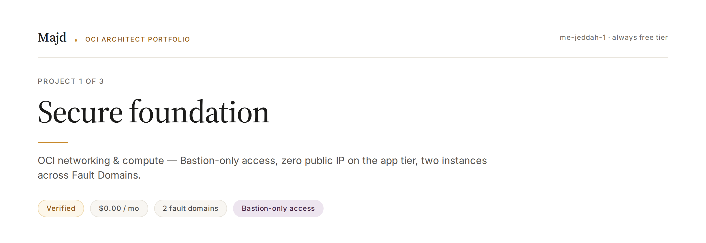
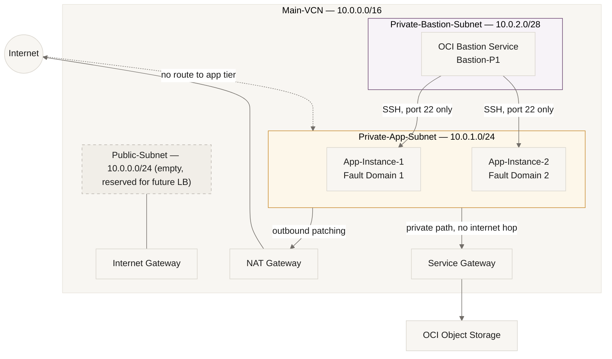

**OCI Networking & Compute · me-jeddah-1 · Always Free Tier**

Verified — implemented, tested, and re-tested against real failure — closed 2026-08-24

---

## Problem

A secure base network needs to run a sensitive application with **zero direct internet exposure** on the application tier, while still allowing patching and backups — and it needs to survive the loss of a single piece of hardware.

## Constraints

| Constraint | Detail |
|---|---|
| Region | `me-jeddah-1` — a single-AD region. High availability has to come from **Fault Domains**, not multi-AD spread. |
| Budget | Always Free Tier, no overage |
| Security | No public IP anywhere on the application tier |

## Architecture

**Reserved for later projects:** `10.0.3.0/24` and beyond, held out of the `/16` for the P3 storage layer (File Storage mount targets) so it never needs to be carved out of an in-use range.

## Resource Naming

| Resource | Name | Note |
|---|---|---|
| Compartment | `Architect-Lab` | Shared across P1/P2/P3 — no per-project compartment |
| VCN | `Main-VCN` | Named as shared infrastructure, not `vcn-p1` |
| Subnets | `Public-Subnet`, `Private-App-Subnet`, `Private-Bastion-Subnet` | — |
| Gateways | `Internet-Gateway`, `NAT-Gateway`, `Service-Gateway` | — |
| Route Tables | `RT-Public`, `RT-Private-App`, `RT-Bastion` | — |
| NSGs | `NSG-App`, `NSG-Bastion` | — |
| Bastion session broker | `Bastion-P1` | Distinct from the `Private-Bastion-Subnet` it sits in |
| Compute | `App-Instance-1` (FD-1), `App-Instance-2` (FD-2) | Same subnet, different Fault Domain — real physical isolation |

## Key Design Decisions

| Decision | Rejected Alternative | Why |
|---|---|---|
| Access via OCI Bastion Service only | Public IP + direct SSH | Zero exposed attack surface on the app tier |
| Split egress: NAT for internet, Service Gateway for Object Storage | Routing everything through NAT | Object Storage traffic never needs to leave Oracle's network — cheaper and more secure |
| Two instances on the same subnet, different Fault Domains | Two subnets across ADs | `me-jeddah-1` has one AD; FDs are the only real hardware-isolation axis available |
| NSG ingress scoped to the Bastion NSG only (10.0.2.0/28), not a CIDR | Allowing SSH from a broader private range | Least privilege — only traffic that actually originated from a Bastion session is trusted |

## Verification — Proof, Not Just a Green Checkmark

A resource showing up in the console is not proof it works. Every claim below was tested from inside a live session, not inferred from configuration.

| Test | Result |
|---|---|
| `curl` to an external site from the private instance | ✅ Succeeded — NAT Gateway path confirmed |
| SSH directly to the private instance from outside Oracle's network | ✅ Failed with `Operation timed out` — isolation confirmed |
| `curl` to Object Storage from the private instance | ✅ Succeeded via Service Gateway (not NAT) — official Oracle response headers (`opc-request-id`, `x-api-id: native`) |
| Deliberately deleted the `NSG-App` ingress rule, then observed | ⚠️ **The connection still worked** — unexpected |

### The finding that mattered most

Deleting the NSG rule was supposed to break SSH access. It didn't. Digging into why surfaced a real gap: OCI's **Default Security List**, automatically attached to `Private-App-Subnet`, had a parallel rule allowing SSH from `0.0.0.0/0` — silently overriding the carefully scoped NSG the whole time.

The fix: removed the `0.0.0.0/0:22` rule from the Security List permanently, restored the original NSG rule, and re-verified access through the Bastion.

**Lesson:** documenting one security layer (NSG) isn't enough. OCI has two independent layers — NSGs and Security Lists — and both must be checked to claim real isolation.

## Cost

| Resource | Free Tier Actual | Theoretical Production Cost |
|---|---|---|
| Compute (2× Always Free micro instances) | $0.00 | ~$15–25/mo for an equivalent pair |
| Block Volume | $0.00 (within 200GB free) | ~$2–4/mo per additional 50GB |
| Data egress | $0.00 (within 10TB/mo free) | ~$0.0085/GB beyond the free allowance |
| Object Storage | $0.00 (0 bytes used) | ~$0.0255/GB/mo (Standard) |
| **Total (confirmed via Cost Analysis, Aug 1–24 2026)** | **$0.00 USD** | **~$17–29/mo** for the same architecture outside Free Tier |

The same design runs free for learning and is production-ready without any architectural change — only the Free Tier ceilings would need to be lifted.

## 60-Second Summary

Built a secure base network on OCI for a sensitive application, with zero public IP on the application tier — access restricted entirely to the OCI Bastion Service — and split egress between a NAT Gateway for general internet traffic and a Service Gateway for Object Storage. The hardest decision was scoping NSG rules to allow SSH only from the Bastion's own subnet range, not any broader source. When I deliberately broke an NSG rule to test isolation, I discovered OCI's Default Security List was silently allowing SSH from anywhere in parallel with the carefully designed NSG — a hands-on lesson that verifying one security layer isn't enough; every layer has to be checked to claim genuine isolation.
