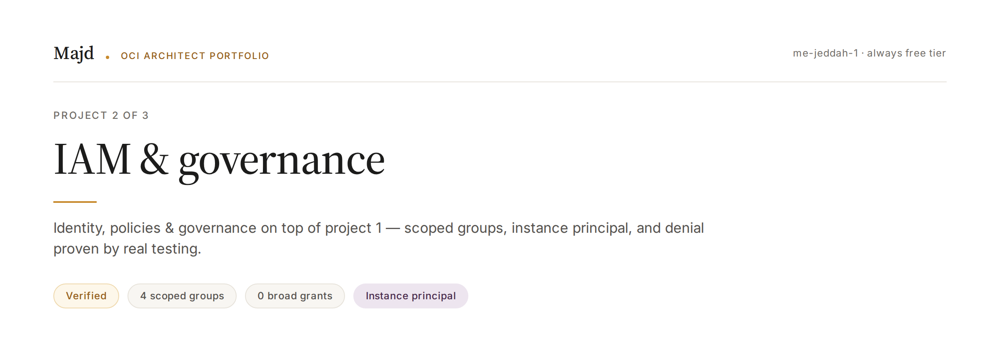
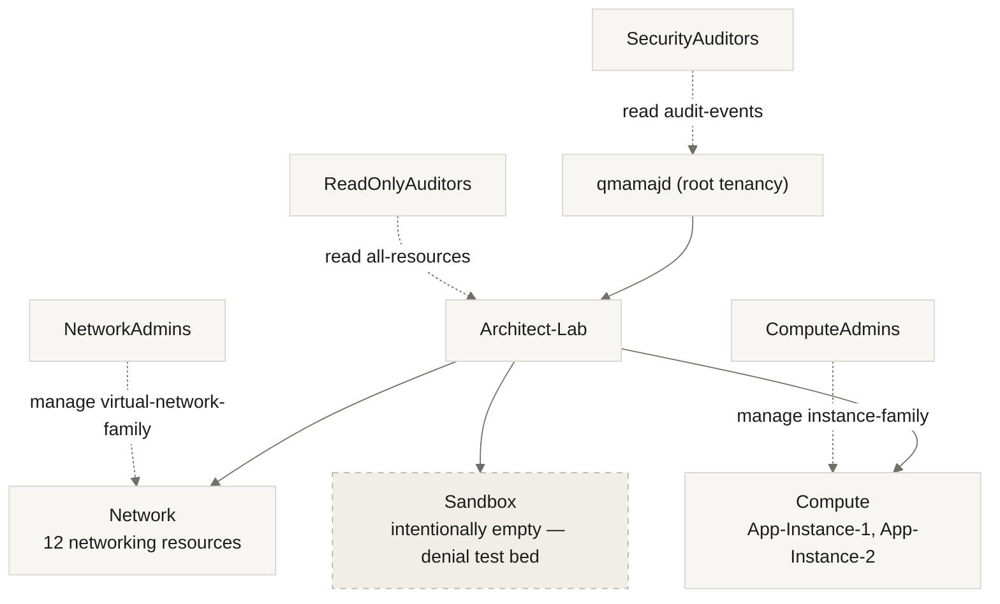

**OCI Identity, Policies & Governance · me-jeddah-1 · Always Free Tier**

Verified — 23/23 steps, Phases A–F — closed 2026-08-27

Builds directly on [Project 1 — Secure Foundation](./P1-Secure-Foundation.md). Same VCN, same environment — no new environment stood up.

---

## Problem

Control precisely who can reach which resource in the environment built in P1, without granting broader permissions than necessary — and prove that denial actually works, not just that access does.

## Compartment Design



**Decision:** functional split (Network / Compute / Sandbox), not dev/prod. Dev/prod was rejected as cosmetic — there is one real environment (a lab), and the naming wouldn't reflect anything true. The functional split matches how P1's resources actually break down, and gives real material for testing what breaks when a resource moves between compartments.

## Groups & Policies

| Group | Scope | Policy (literal text) |
|---|---|---|
| `NetworkAdmins` | manage networking, `Network` only | `Allow group NetworkAdmins to manage virtual-network-family in compartment Network` |
| `ComputeAdmins` | manage instances, `Compute` only | `Allow group ComputeAdmins to manage instance-family in compartment Compute` |
| `ReadOnlyAuditors` | read everything, no edits | `Allow group ReadOnlyAuditors to read all-resources in compartment Architect-Lab` |
| `SecurityAuditors` | read audit/security logs only | `Allow group SecurityAuditors to read audit-events in tenancy` (attached at root — `audit-events` is a tenancy-level resource) |

No group holds `manage all-resources` anywhere. Each policy is scoped to exactly one compartment and one resource family.

> **Key correction, proven by testing (2026-08-25):** the compartment path inside a policy statement is **relative to the attachment point**, not absolute from the tenancy root. A policy attached at `Architect-Lab` writes `in compartment Network` directly — `Architect-Lab:Network` fails with an explicit API error, because it would resolve to a non-existent child. The same policy attached at the *root* would instead need `in compartment Architect-Lab:Network`. The rule isn't "always use `:`" — it's "the path is measured from wherever the policy is attached."

## Instance Principal — Non-Human Identity

An `App-Instances-DG` dynamic group (matching on the `Compute` compartment) was granted read access to exactly one bucket, with no API key stored anywhere on the instance:

```
Allow dynamic-group App-Instances-DG to read objects in compartment Architect-Lab
  where target.bucket.name = 'p2-instance-principal-test'
```

**Verified from inside `App-Instance-1`, no stored credentials:**
- `oci os object list --bucket-name p2-instance-principal-test --auth instance_principal` → succeeded, returned `proof.txt`
- The exact same command against a *different* bucket (`p1-storage-test`) → rejected with **404 BucketNotFound**, not 403. Only the bucket name changed between the two calls — the `where` clause alone was the entire difference.

## Verification — Proving Denial, Not Just Access

IAM isn't proven by what it allows. It's proven by what it blocks.

| Test | Result |
|---|---|
| A scoped test user (`test-net-admin`, `NetworkAdmins` only) tries to list instances in `Compute` | ✅ Rejected: `Authorization failed or requested resource not found` — no listing, no visibility |
| Same session, same user: list the VCN in `Network` | ✅ Succeeded — access is exactly as scoped, no more, no less |
| Move `Private-App-Subnet` from `Architect-Lab` to `Network` mid-session | ✅ Both instances stayed `Running`, IPs unchanged — compartment boundaries are **governance-only, not network-level** |
| Delete `P2-NetworkAdmins-Policy`, observe, then restore it | ✅ Access broke immediately on delete, returned instantly (no propagation delay) on restore — proof that *this specific statement* was the source of access, not inheritance |

### The finding that mattered most

Verification exposed a silent architectural debt: moving `Main-VCN` into the `Network` compartment in Phase A did **not** move its 12 child resources (3 subnets, 4 route tables, the default security list, 2 NSGs, 3 gateways). `NetworkAdmins`' policy was effectively guarding an almost-empty compartment for two days before this surfaced — none of it was visible until the Phase F access tests exposed it. All 12 resources were manually relocated, one at a time.

**Lesson:** creating a compartment and moving the parent resource into it does not create a real governance boundary. The boundary has to be built resource by resource, and its completeness can't be assumed without an inventory.

## Governance

| Control | Configuration | Purpose |
|---|---|---|
| Tagging | `Governance.Project` tag (P1/P2/P3), cost-tracking enabled | Cost attribution per project |
| Budget | `P2-ArchitectLab-Budget`, €10/mo, alerts at 50% and 80% | Spend visibility — **alerts only, does not block anything** |
| Quota | `P2-Sandbox-Quota` — zeroes then re-grants 2 cores for `standard-a1` in `Sandbox` | The **only** mechanism that actually prevents resource creation, as opposed to alerting |
| Cloud Guard | Target = tenancy root (required for IAM monitoring), Configuration + Activity Detector recipes attached, no auto-responder | Detection with a deliberate, documented decision not to auto-remediate |

## Cost

Fully within Always Free — the value here is entirely in access control, not spend. Budgets/quotas are configured to *prevent* future cost overrun (Sandbox instance quota), not because current usage costs anything.

## 60-Second Summary

Built a governance layer on top of an existing OCI environment. The problem: control precisely who can reach what, and prove denial actually works rather than just documenting intended permissions. I split resources functionally across three compartments — Network, Compute, Sandbox — rejecting dev/prod as cosmetic for a single real environment. Four groups, each scoped to one compartment and one resource type — no group holds broad `manage all-resources` rights. I added Instance Principal: a non-human identity that reads exactly one bucket via a `where` clause, with zero credentials stored on the server.

But the part I'm proudest of is verification. I tested denial with a real restricted account in a separate session, moved a resource and measured the blast radius, and deleted a policy to watch access collapse — then restored it and watched access return instantly. That testing surfaced a bug that wasn't visible any other way: moving the VCN in Phase A never moved its 12 child resources, so `NetworkAdmins`' policy was guarding a nearly empty compartment. I fixed it.

**The takeaway:** governance isn't measured by what it allows — it's measured by what it blocks. And a boundary isn't created by moving one parent resource; it's built resource by resource, and its completeness can't be assumed without an inventory.
