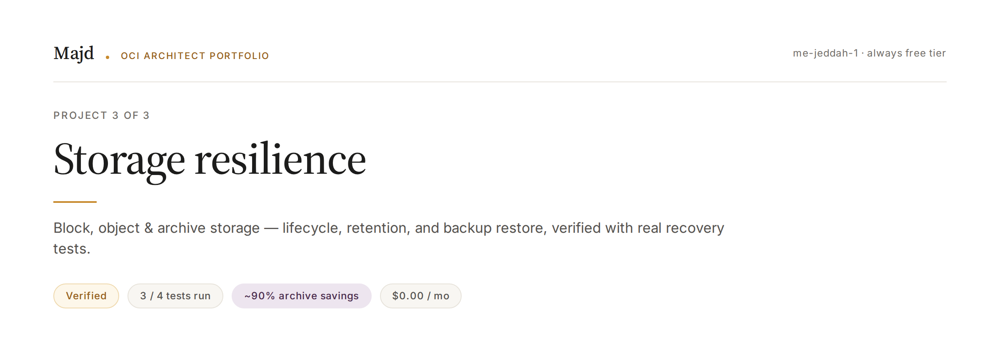
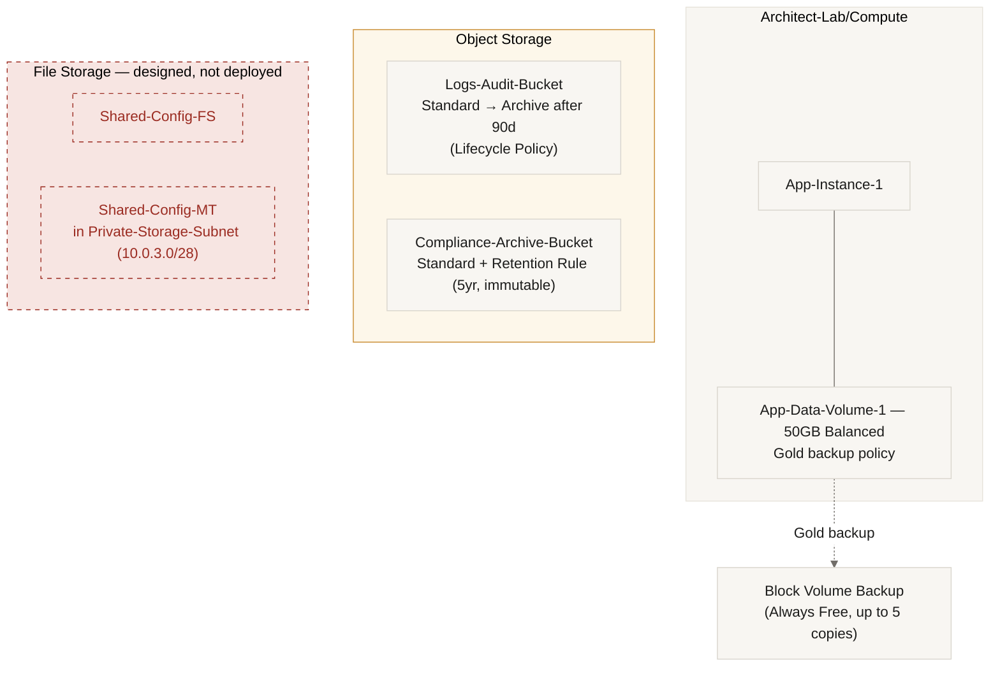

**OCI Block, Object & Archive Storage · me-jeddah-1 · Always Free Tier**

Verified — closed 2026-08-28. Block + Object Storage fully implemented and tested. File Storage fully designed but blocked by a real Free Tier service limit (documented below, not hidden).

Builds directly on [Project 1 — Secure Foundation](./P1-Secure-Foundation.md) and [Project 2 — IAM & Governance](./P2-IAM-Governance.md). Same VCN, same governance model — no new environment.

---

## Problem

A client stores all their data the same way, at the same cost, regardless of how often it's actually accessed — overpaying for data nobody reads, with no real confidence that critical data is actually recoverable in a disaster.

## Data Map — Before Choosing Any Service

| Data | Access Frequency | Acceptable Recovery Time | Service & Tier | Rejected Alternative |
|---|---|---|---|---|
| Compute boot/data volumes | Very high (constant) | Instant | Block Volume — Balanced (VPU=10) + Gold backup policy | Bronze policy — weekly retention isn't enough for production-critical data |
| Application logs / audit trail | High for 30 days, then near-zero | Minutes, after 30 days | Object Storage Standard → Lifecycle Policy to Archive after 90 days | Leaving it in Standard forever — unjustified cost for data nobody reads |
| Compliance documents (must never be deleted) | Very rare | Hours (Archive restore) | Object Storage + Retention Rule (immutable) | Block Volume snapshot — no legally enforceable immutability |
| Shared config files, concurrent multi-writer | High, concurrent | Instant | File Storage (NFS) + Mount Target — outside Always Free, real cost even at small scale | Object Storage — no POSIX locking, no real concurrent writes |

## Architecture

## Resource Naming

| Resource | Name | Note |
|---|---|---|
| Block Volume | `App-Data-Volume-1` | 50GB, Balanced (VPU=10), attached to `App-Instance-1` |
| Backup Policy | Gold | Oracle-managed — daily/weekly/monthly/yearly retention |
| Object Bucket 1 | `Logs-Audit-Bucket` | Standard by default, Lifecycle to Archive at 90 days |
| Object Bucket 2 | `Compliance-Archive-Bucket` | Standard + immutable Retention Rule |
| Lifecycle Policy | `Logs-To-Archive-90d` | On `Logs-Audit-Bucket` only |
| Retention Rule | `Compliance-Lock-5y` | On `Compliance-Archive-Bucket` only |
| File System (designed) | `Shared-Config-FS` | Blocked — see below |
| Mount Target (designed) | `Shared-Config-MT` | Blocked — see below |
| Quota Policy | `P3-FileStorage-Quota-Cap` | Caps file-system-count / mount-target-count at 1 each |

## Key Design Decisions

| Decision | Rejected Alternative | Why |
|---|---|---|
| Retention Rule over Object Versioning for compliance data | Versioning | OCI doesn't allow both on the same bucket. Retention blocks deletion even for an Administrator; Versioning only allows recovery after the fact — weaker guarantee |
| Lifecycle to Archive at 90 days, not 30 | 30-day cutoff | 90 days leaves a safety margin for a late-starting investigation before data goes cold |
| Balanced (VPU=10) block volume performance | Higher/Ultra High Performance | No evidence of IOPS pressure to justify the extra cost |
| Manual snapshot before any auto-schedule (File Storage design) | Auto-schedule immediately | Same principle as the verification tests below — an unrestored backup isn't a backup |

## Verification — Proof, Not Just a Status Badge

*"A backup that has never had its restore tested is not a backup."*

| # | Test | Result |
|---|---|---|
| 1 | Delete an object protected by a Retention Rule | ✅ Blocked — `RetentionRuleViolation`. Protection holds even for the account owner, not just against other users |
| 2 | Read an Archived object directly, without requesting a restore | ✅ Blocked at the **UI control level** — Download/Copy were greyed out automatically, before any API error was even needed. Requested Restore (default 24h window); object became `Restored` and successfully downloaded in **~52 minutes** |
| 3 | Restore a Block Volume from its Gold backup | ✅ Verified — but the original plan (restore onto a new Compute instance) hit a real wall: `standard-e2-micro-core-count` was 2/2 used, 0 available on Free Tier (confirmed via Limits, Quotas and Usage — a primary source, not assumed). Pivoted to a standalone `Create Volume from Backup` with zero instance attachment, which needs no Compute quota. Restored in under 2 minutes. Verified via console-reported metadata (state, compartment, size, creation time); the test volume was deleted afterward |
| 4 | Delete a file, restore from a File Storage snapshot | ⬜ Not runnable — File Storage itself is undeployed (see below) |

### The finding that mattered most

The Archive read test proved something more useful than a documented error message: OCI disables the **Download and Copy controls themselves** on an archived object, before the request is even sent — not just a rejected API call after the fact.

The Block Volume test proved a different kind of lesson: the "correct" verification plan (a fresh instance) wasn't actually available, and confirming that with a primary source (the Limits page) — rather than assuming a workaround existed — is what surfaced a real Free Tier constraint and led to a cleaner, zero-quota alternative that proved the same thing.

## File Storage — Designed, Deliberately Not Deployed

The network layer for File Storage (`Private-Storage-Subnet`, `RT-Storage`, `NSG-Storage` with NFS ports 111/2048/2049/2050) is fully designed and matches the same governance pattern as P1/P2. Creating `Shared-Config-FS` itself failed at a real API error: `file-system-count` Service Limit = **0** for this Free Tier tenancy — a constraint that only lifts with an upgrade to a paid account.

This is a deliberately deferred financial decision, not an oversight — fully documented in Build Log and Decision Cards, ready to execute the moment a paid account is available.

## Cost Optimization

| Change | Before | After | What You Pay For The Improvement |
|---|---|---|---|
| `Logs-Audit-Bucket` without Lifecycle | Standard forever — ~$0.0255/GB/mo | Archive after 90 days — ~$0.0026/GB/mo (~90% cheaper) | Longer restore time for objects older than 90 days — minutes, not milliseconds |
| `App-Data-Volume-1` without Gold policy | Bronze or no backup — $0.00 extra, monthly RPO | Gold — $0.00 within Always Free (up to 5 free copies), daily RPO | No monetary cost within Free Tier — the price is operational complexity in managing the schedule |
| File Storage (designed, blocked) | Doesn't exist — $0.00 | If deployed on a paid account: ~$0.30/GB/mo storage + mount target fees | This is the direct price of real concurrent multi-writer access — there's no free equivalent in OCI for this capability |

## 60-Second Summary

Built a resilient storage layer on OCI spanning Block, Object, and File storage together, with one deliberate design decision per data type instead of treating everything the same way. Key decisions: a Gold backup policy on the Block Volume for daily RPO, a Lifecycle Policy moving logs to Archive after 90 days to cut cost without losing flexibility, and a Retention Rule instead of Object Versioning for compliance data because it blocks deletion even for an Administrator.

The most important lesson was discovering that some design decisions conflict with each other technically — Versioning and Retention Rules can't coexist on the same OCI bucket — and that the strongest constraints aren't always the ones I set myself. The File Storage project was fully designed, down to the network layer, but stopped at a real, zero-value Service Limit for Free Tier tenancies — a financial constraint, not a technical one. That taught me to distinguish between a Compartment Quota I control and a Service Limit Oracle sets based on account type.

I verified three of four recovery scenarios with real tests — a blocked delete, a blocked-then-restored Archive read, and a Block Volume restore that survived a real compute-quota wall by pivoting cleanly instead of forcing it. The fourth is honestly documented as blocked, not quietly skipped.
