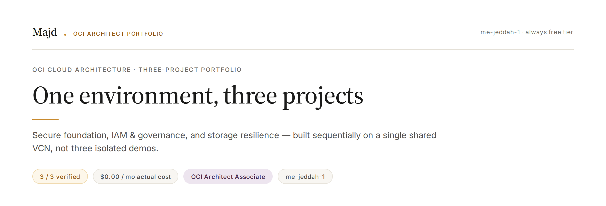
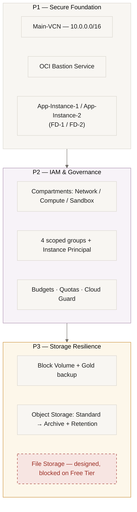

Three hands-on projects on Oracle Cloud Infrastructure, built sequentially on a **single shared VCN** in `me-jeddah-1` under Free Tier constraints — each project layers on top of the last rather than starting fresh, the way real infrastructure actually grows.

**Tenancy:** `qmamajd` · **Region:** `me-jeddah-1` · **Identity domain:** Default

## Certification Roadmap

- ✅ OCI Foundations Associate — Complete
- ✅ OCI Architect Associate (1Z0-1072-26) — Complete (exam + 3 hands-on projects)
- ✅ OCI AI Foundations Associate — Exam passed on September 12, 2026 (project in progress)

---

## Why one environment, not three

Every project here builds on the same `Main-VCN` instead of standing up an isolated sandbox per topic. That was a deliberate choice: real architecture decisions have consequences that only show up once something else already depends on them. Moving a VCN's compartment doesn't move its child resources. A policy written for one compartment silently fails when the resource it's meant to guard lives somewhere else. None of that is visible in an isolated demo — it only surfaces when layers actually stack, which is exactly what happened across P1 → P2 → P3.

## The three projects

| # | Project | What it adds | Status |
|---|---|---|---|
| 1 | [Secure Foundation](./P1-Secure-Foundation.md) | VCN, subnets, NAT/Service/Internet gateways, Bastion-only access, two-instance HA across Fault Domains | ✅ Verified |
| 2 | [IAM & Governance](./P2-IAM-Governance.md) | Compartment-based access control, 4 scoped groups, Instance Principal, budgets/quotas/Cloud Guard | ✅ Verified |
| 3 | [Storage Resilience & Cost Optimization](./P3-Storage-Resilience.md) | Block Volume backups, Object Storage lifecycle/retention, File Storage design (blocked by a real Free Tier limit) | ✅ Verified |

## Architecture across all three projects

## What makes these different from a tutorial walkthrough

Every project has a **Verification** section with tests that were actually run — not resources that were merely clicked into existence and assumed to work. Highlights across the portfolio:

- **P1:** deliberately broke an NSG rule to test isolation — and it *didn't* break, exposing a parallel Default Security List rule that had silently allowed SSH from anywhere the whole time.
- **P2:** logged in as a real restricted user in a separate browser session to prove denial, then deleted a policy mid-session and watched access collapse and recover.
- **P3:** hit a real Free Tier Compute quota wall (2/2 cores used) trying to restore a Block Volume onto a new instance, confirmed it against the primary Limits/Quotas page rather than assuming a workaround, and pivoted to a zero-quota restore path that proved the same thing.

Every design decision — and every rejected alternative — is logged with a reason in a running Decision Log, not just a final "it worked" screenshot.

## Cost discipline

All three projects run at **$0.00** actual cost, confirmed against OCI Cost Analysis — while every design decision includes what the same architecture would cost in production outside Free Tier, so the trade-offs are never presented as free.
